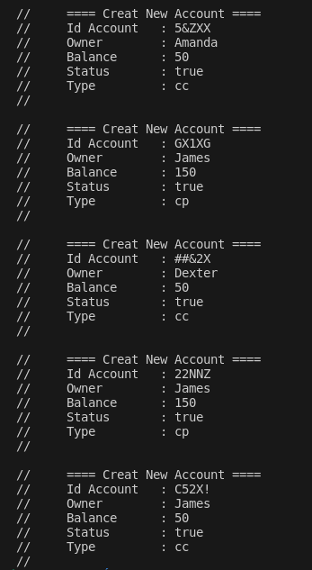

# Bank Account Generator

O **Bank Account Generator** é um algoritmo simples que gera 5 contas bancárias com dados aleatórios, como ID da conta, proprietário e saldo inicial. Ele permite criar contas de dois tipos: **Conta Corrente (CC)** e **Conta Poupança (CP)**.

## Funcionalidades

- Geração de IDs aleatórios para as contas.
- Criação de contas com dois tipos: 'CC' (Conta Corrente) e 'CP' (Conta Poupança).
- Cada conta começa com um saldo predefinido: 50 para CC e 150 para CP.
- Impressão das informações de cada conta no terminal, incluindo o ID, proprietário, saldo, status e tipo de conta.
- Testes com **Jest** para verificar integridade do codigo

## Como Usar

### Requisitos

Certifique-se de ter o **Node.js** instalado. Caso não tenha, execute os seguintes comandos (para distribuições Debian):

```bash
    sudo apt-get update
    sudo apt-get install nodejs
    sudo apt-get install npm
```

### Clone o repositório

```bash
    git clone https://github.com/LacamJC/bankAccountGenerator.git
```

### Entre na pasta do projeto

```bash
   cd bankAccountGenerator/
```

### Execute o arquivo `main.js`

```bash
    node main.js
```

## Exemplo de saída do terminal



## Estrutura de Arquivos

- **RandomId.js**: Contém a função que gera um ID aleatório para cada conta.
- **RandomOwner.js**: Contém a função que gera o nome aleatório do proprietário da conta.
- **main.js**: Contém a lógica principal do algoritmo, onde as contas são criadas e suas informações são exibidas no terminal.

## Licença

Este projeto está licenciado sob a MIT License - veja o arquivo [LICENSE](LICENSE) para mais detalhes.
